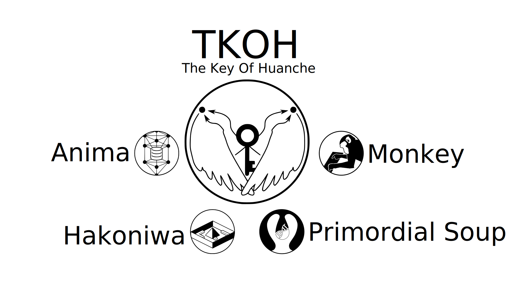
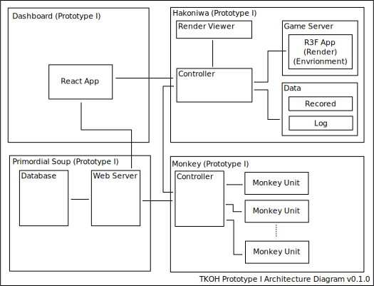

# Day 02 The Key Of Huanche 專案介紹

## 簡介

環驅之鑰 (The Key Of Huanche) 為本人專案導向學習的主要專案之一，旨在建立：

> 以布林類神經網路為基礎之人工智慧，在 Minecraft-like (Voxel) 世界具有建立具有組織、文字、文化等文明特性之群落。

起於 *SyntheticEmpire* 專案，後發展為 *大地人* 專案，又因涉及多種不同層面的應用、技術與系統，與其他專案整併後建立的超集合型專案。

## 子專案

本專案由四大子專案構成，分別是：
- Hakoniwa
    - 目的在於開發一個系統用於運行 Minecraft-like (Voxel) 世界。
- Monkey
    - 目的在於開發一個系統用於運行基於布林類神經網路的人工智慧。
- Primordial Soup
    - 目的在於建立布林類神經網路的相關理論與工程規格，並開發一個系統用於儲存布林類神經網路的。
- Anima
    - 目的在於實現編輯布林類神經網路使其依照特定的目的運行。

## 本次鐵人賽的目標

以下是我定下本次鐵人賽必須實作項目，其中部份已經完成實作、實作過但是失敗又或是在腦中複習無數次概念但是基於一些現實因素而還沒付諸實踐，因素包含學習曲線、技術門檻...等。

### Hakoniwa Prototype

- Headless 渲染 3D 場景
- 執行 Environment
- 透過 IPC 接收 Agent Action 和傳輸 Environment 資訊（影像資料）

### Primordial Soup Prototype

- 一些基本的 BNN 工具
- 能儲存 BNN 組態的伺服器，包含基本的 CRUD

### Monkey Prototype

- 能執行 BNN 組態的程式
- 透過 IPC 與 Environment 互動
- 輸入為影像資料

## 名詞解釋

- SyntheticEmpire 專案
  - 一個關於建造蟲群 (Hive mind) AI 作為玩家敵人的概念。遺憾是當時寫的程式碼在無數次整理硬碟的過程中遺失了，只剩下當時留下的[影片紀錄](https://youtu.be/vH0KOeijNeQ)，實作的部份只進行到透過繼承 `ZombieEntity` 試圖建構一個在各方面都跟玩家一樣的生物實體。
- 大地人
  - SyntheticEmpire 專案的後繼者，概念更著重於 NPC 自力更生；而不是與玩家對抗。僅停留在概念階段而無任何實作。關於概念的具體描述，可以參考我的[這篇文章](https://flyskypie.github.io/blog/2019-01-11-A_Idea_of_Native_Agents_in_a_Voxel_World/)。
- 超集合型專案 (The Superset Project)
  - 因為本人有嚴重的[閃亮量症候群](https://medium.com/frontend-fighter/2afcc3ced07f)，所以透過一種模式去控制它：所有 Side Project 都必須是這個超級集合專案的子集，如此一來即便這些小專案被半途而廢，過程累積的經驗值都能夠貢獻到這個超集合的目標上，並且能夠在這個架構下把進度或概念重組/重新分配給其他專案。
- BNN
  - 布林類神經網路 (Boolean Neural Network)。
- CRUD
  - 資料庫的基本操作：新增、讀取、更新與刪除 (Create, read, update and delete)。
- IPC
  - 行程間通訊 (Inter-Process Communication)。
- Environment
  - 增強式學習的術語，通俗的講：AI 操作遊戲角色，Environment 就是遊戲環境。
- Agent
  - 增強式學習的術語，通俗的講：遊戲角色就是 Agent。